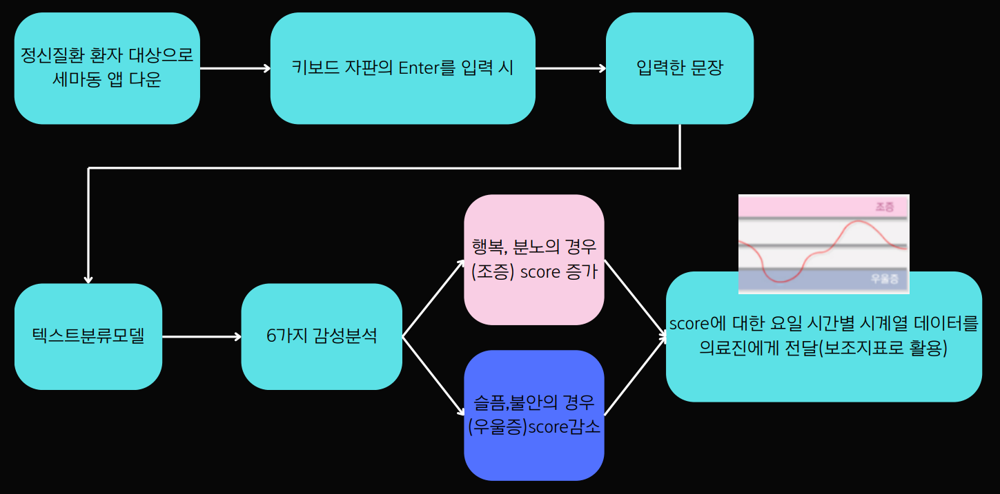
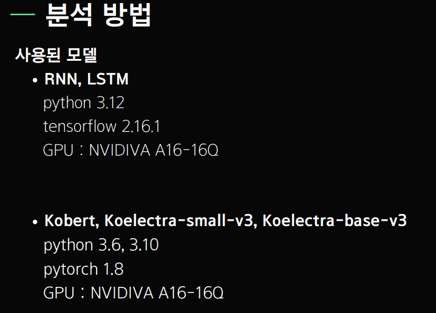
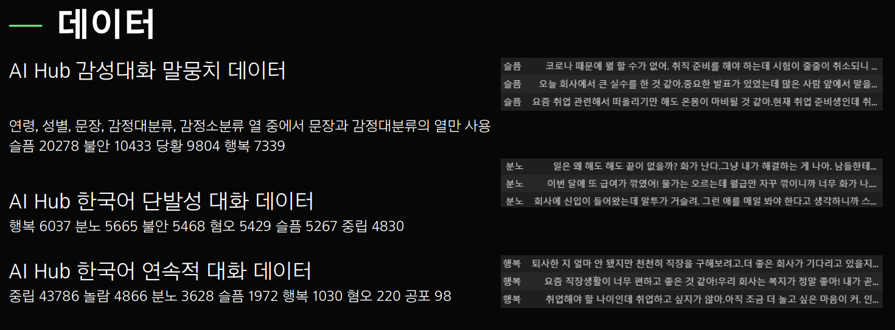
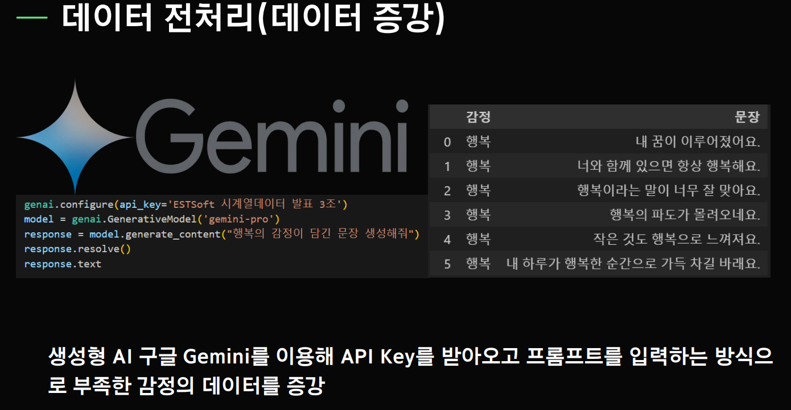
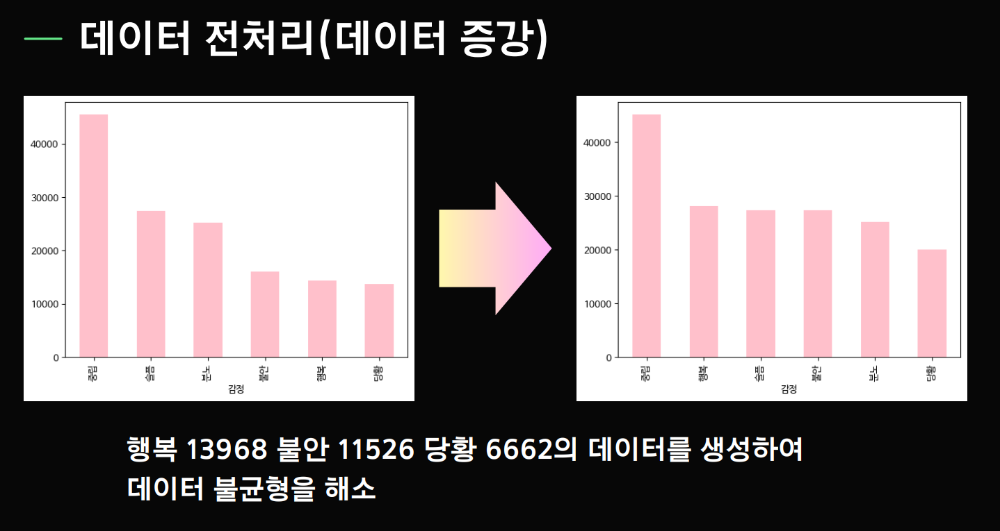
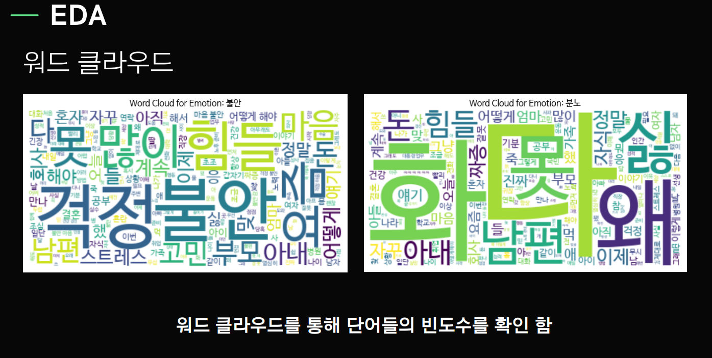
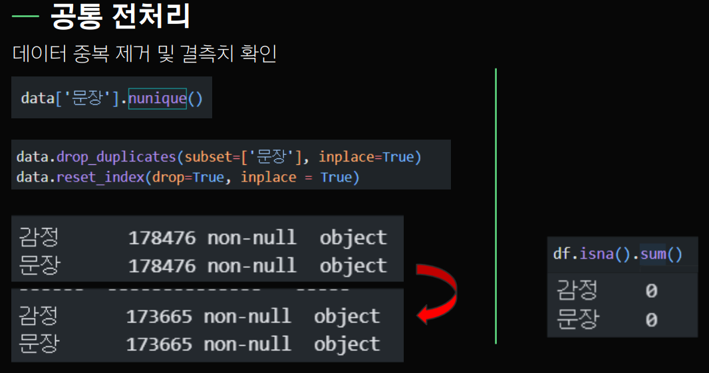
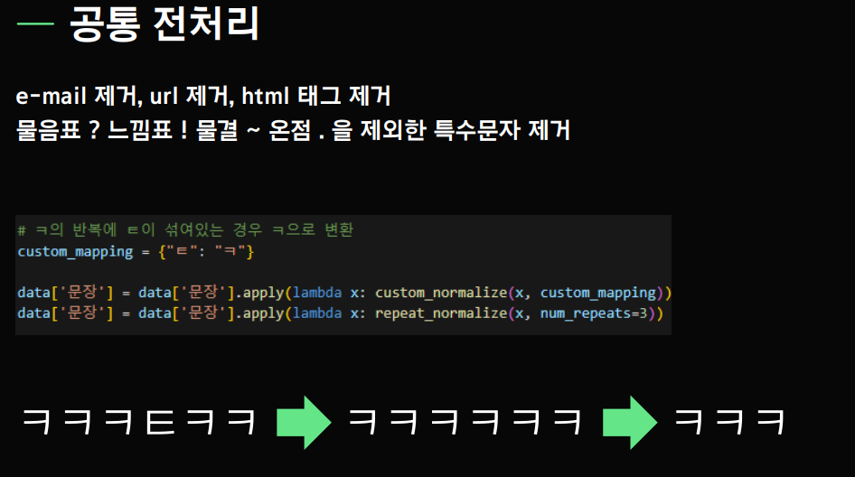
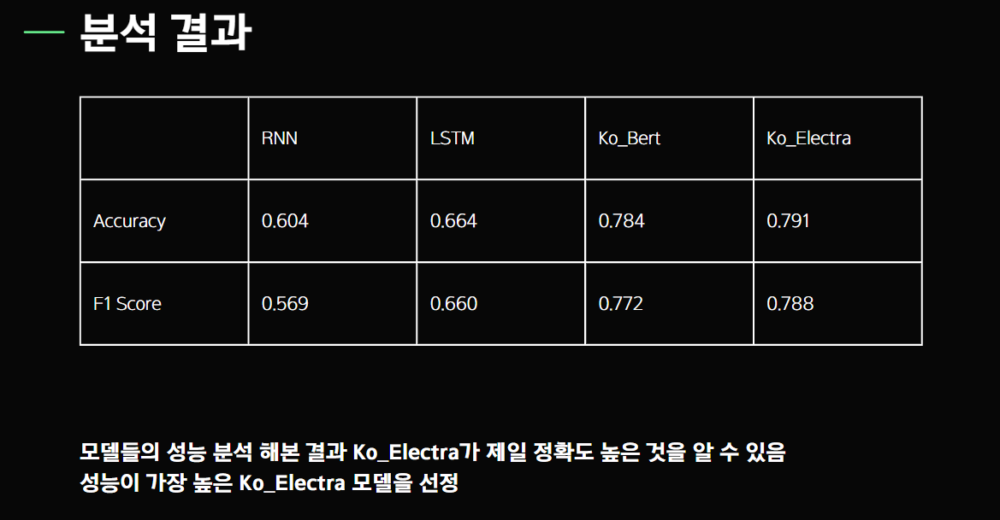

# korean_text_Sentiment_Classification

# 대화 데이터를 통한 단극성/양극성 정동장애 구별 보조지표 세모난 마음을 동그랗게 세.마.동

## :alarm_clock: 개발 기간: 3월 27일(목) ~ 4월 15일(수)

## 개발환경:

|IDE|프로그래밍 언어|
|------|---|
|||

## :people_holding_hands: 멤버구성 및 역할
김토일(팀장): EDA, Modeling(KoBert, Koelectra-base), preprocessing, text augmentation(gemeni), Presentation, PPT

이재익(팀원): EDA, Modeling(RNN,LSTM), preprocessing, Presentation, PPT

정치훈(팀원): EDA, Modeling, preprocessing, PPT

## :bulb: 기획 선정 및 배경
프로젝트 배경

단극성 우울증의 증상이 우울증과 정상 사이를 오가는 것과 비교하면 양극성 우울증은 울증과 조증 사이를 오가는 증상이 있는데, 양극성 우울증을 단극성 우울증과 구분해야 하는 이유가 있습니다. 조울증은 환자가 우울증 상태일 때 병원에 오기 때문에 우울증으로 진단될 가능성이 높다고 합니다. 이러한 환자에게 우울증 치료제를 사용하면 오히려 더 위험에 처하게 될 수 있다고 하기 때문에 정확한 진단이 필요하고, 조울증은 안타까운 일이지만 자살률이 높습니다, 특히 울증에서 조증으로, 조증에서 울증으로 증상이 바뀌는 구간에서 특히 그런 일이 자주 일어난다고 합니다. 따라서 저희의 목표는 의사에게 진료에 필요한 보조지표를 제시함으로써 진단을 정확히 할 때 도움이 되고자 이러한 주제를 선정해보았습니다.

## :robot: 모델 개발
> ### DATA

### 데이터 출처
https://www.aihub.or.kr/aihubdata/data/view.do?currMenu=115&topMenu=100&aihubDataSe=data&dataSetSn=86
https://aihub.or.kr/aihubdata/data/view.do?dataSetSn=270
https://aihub.or.kr/aihubdata/data/view.do?dataSetSn=271

### 데이터 증강 
google gemini 프롬프트를 이용해 텍스트 감성 데이터 증강

> ### EDA
wordcloud

> ### Preprocessing

기타 전처리 : 불용어 처리, Lemmatization, Nomalizer, mecab 형태소 분리

> ### Modeling

rnn, lstm, KoBert, Koelectra-base, Koelectra-small 모델을 돌려보고 f1-score 및 acc를 측정하였습니다.

모든 모델들의 f1-score와 acc를 측정한 결과, 단일 모델인 Koelectra-base가 f1-score 0.791, acc 78.8%로 가장 높은 성능을 보였습니다. 따라서 Koelectra-base를 감정 분석 모델로 선정했습니다.

